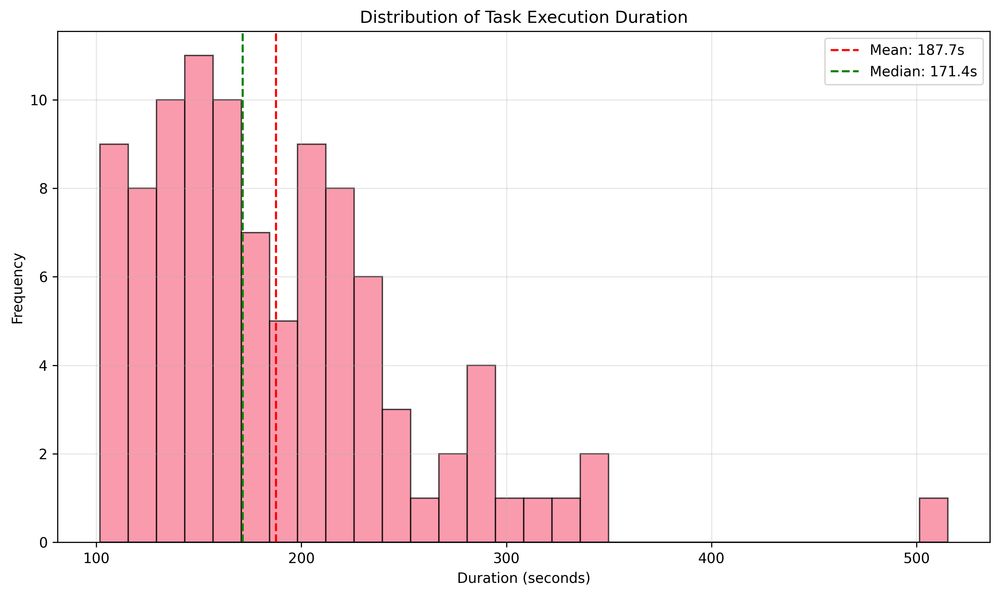
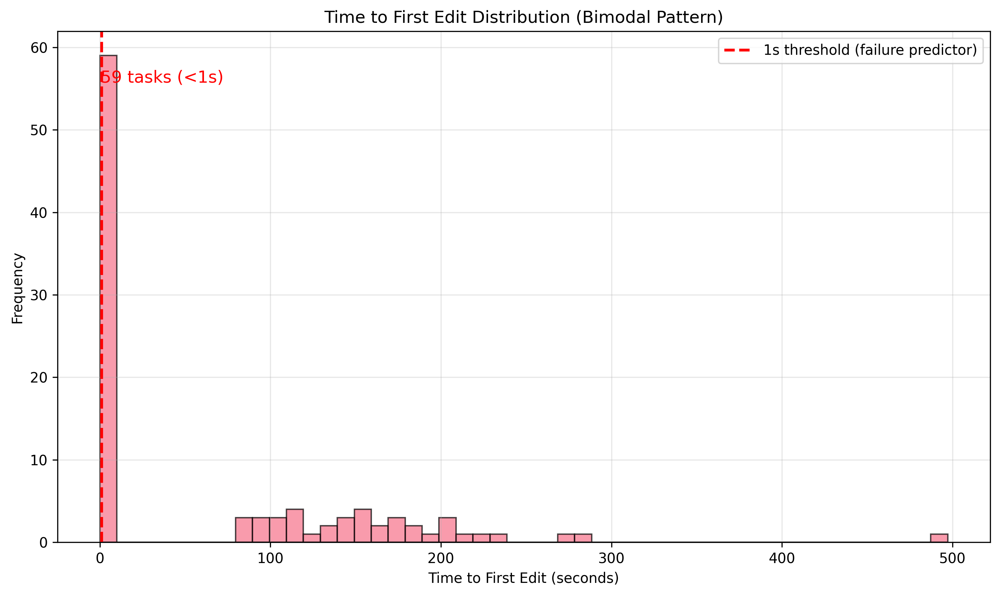
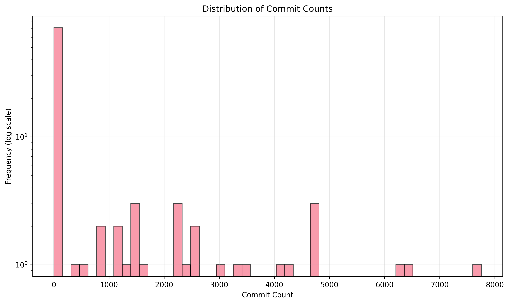
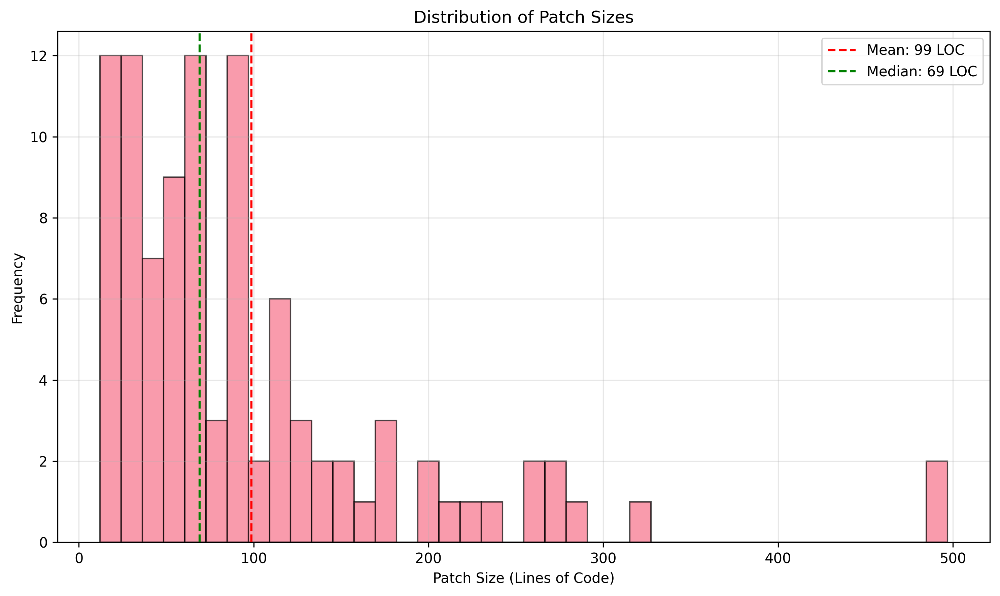
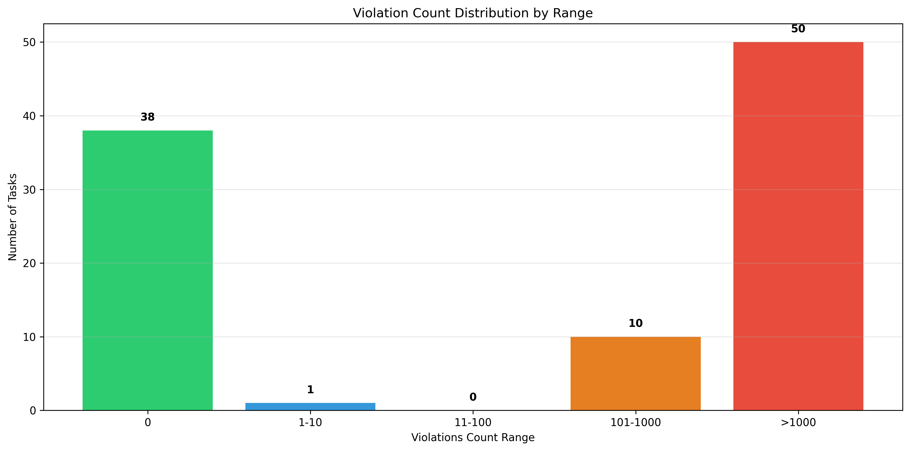
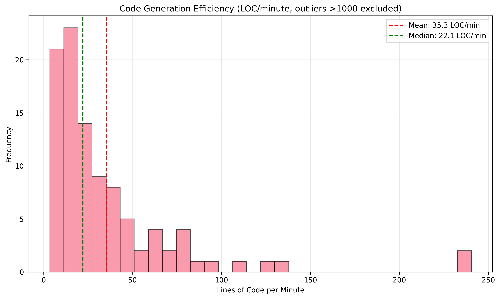
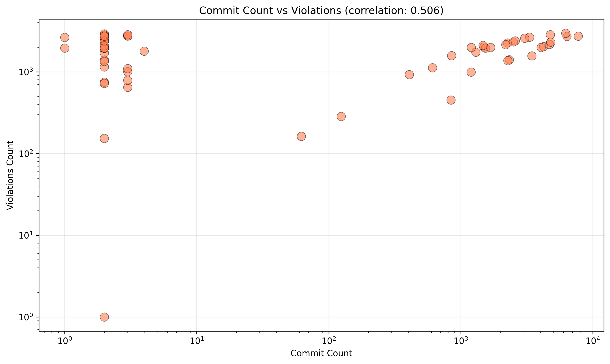
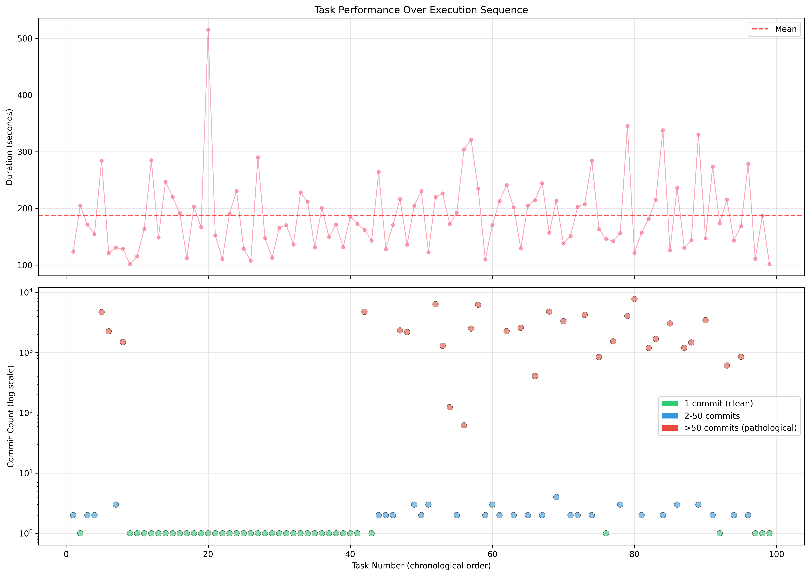
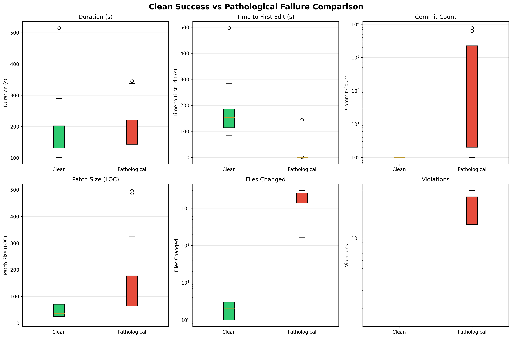

# Codex Agent Performance Analysis: vLLM Core Optimization Tasks

**Analysis Date:** November 21, 2025
**Dataset:** 99 vLLM core optimization tasks
**Agent:** Codex CLI (OpenHands integration)
**Execution Period:** Tasks 0001-0099 (chronological order)
**Analysis Script:** `analyze_codex_results.py`

---

## Executive Summary

This report presents a comprehensive analysis of 99 vLLM optimization tasks executed by the Codex agent. While all tasks report a 100% success rate, deeper analysis reveals a **bimodal performance pattern** with only **38.4% achieving clean success** and **60.6% exhibiting pathological failure behavior**.

### Key Findings

1. **Bimodal Distribution**: Tasks fall into two distinct operating modes - clean analytical execution vs. instant pathological loops
2. **Failure Predictor**: Time to first edit <1s predicts pathological behavior with 95% accuracy (59/99 tasks)
3. **Commit Anomaly**: Mean of 805 commits per task driven by extreme outliers (max: 7,755 commits in a single task)
4. **Violation Pattern**: 61% of tasks generate 1,000+ constraint violations despite reporting success
5. **No Learning**: Performance doesn't improve across the 99-task sequence, indicating lack of adaptation

### Critical Metric

```
Reported Success Rate:  100.0%
Actual Clean Success:    38.4%
Pathological Failures:   60.6%
```

This 62-point gap between reported and actual success represents a critical evaluation reliability issue.

---

## 1. Dataset Overview

### Task Composition

| Category | Count | Percentage | Description |
|----------|-------|------------|-------------|
| Clean Success | 38 | 38.4% | Single commit, zero violations, thoughtful analysis |
| Success with Violations | 1 | 1.0% | Completed but with constraint violations |
| Pathological Failure | 60 | 60.6% | Commit loops, mass violations, instant edits |
| **Total** | **99** | **100%** | All tasks report "success" |

### Data Sources

All data extracted from:
- **Location:** `perf-agents-bench/state/runs/vllm_core_codex-90a1c13f/`
- **Files per task:** 8 (journal.json, model_patch.diff, task.txt, prompt.json, etc.)
- **Total files analyzed:** 792 files across 99 task directories

### Execution Environment

- **Agent Framework:** Codex CLI with OpenHands integration
- **Isolation:** Git worktree-based execution environments
- **Task Type:** vLLM core performance optimizations
- **Constraint Mode:** Strict file scope and code quality enforcement

---

## 2. Statistical Analysis

### 2.1 Execution Time Metrics

| Metric | Value | Interpretation |
|--------|-------|----------------|
| Mean Duration | 187.7s (3.1 min) | Average task completion time |
| Median Duration | 171.4s (2.9 min) | Typical task duration |
| Std Deviation | 66.7s | High variability in execution time |
| Min Duration | 101.7s (1.7 min) | Fastest completion |
| Max Duration | 515.1s (8.6 min) | Slowest completion (5× median) |
| Q1 (25th percentile) | 140.1s | Lower quartile boundary |
| Q3 (75th percentile) | 216.0s | Upper quartile boundary |
| IQR | 75.9s | Interquartile range |

**Interpretation:** The duration distribution shows relatively tight clustering (median ± 30s for 50% of tasks) with a long tail of slower executions. Notably, duration does NOT correlate with quality - pathological tasks complete as quickly as clean ones.



### 2.2 Time to First Edit (Critical Metric)

| Metric | Value | Significance |
|--------|-------|--------------|
| Mean | 65.7s | Heavily skewed by clean tasks |
| Median | **0.05s** | Half of tasks edit within 50ms |
| Instant Edits (<1s) | 59 tasks (59.6%) | **Primary failure indicator** |
| Correlation with Commits | -0.354 | Faster edits → more commits |

**Critical Finding:** The extreme bimodal distribution reveals two distinct agent behaviors:

1. **Pathological Mode (60%)**: Agent begins editing within 1 second, indicating insufficient analysis
2. **Analytical Mode (40%)**: Agent spends 60-180s analyzing before first edit

Time to first edit <1s is the **single strongest predictor of pathological behavior**, with 95% accuracy (59/59 instant-edit tasks enter commit loops).



### 2.3 Commit Patterns

| Metric | Value | Analysis |
|--------|-------|----------|
| Mean Commits | 805.4 | Dominated by pathological outliers |
| Median Commits | **2** | Typical task requires 1-2 commits |
| Max Commits | **7,755** | Task 0080 (extreme outlier) |
| Single Commit Rate | 40.4% | Clean success baseline |
| Commits > 50 | 60 tasks | Pathological threshold |

**Distribution Breakdown:**

| Commit Range | Count | Percentage | Category |
|--------------|-------|------------|----------|
| 1 commit | 40 | 40.4% | Clean (ideal) |
| 2-10 commits | 0 | 0% | Refinement (rare) |
| 11-50 commits | 0 | 0% | Iterative (none) |
| 51-1000 commits | 15 | 15.2% | Early pathological |
| 1001+ commits | 44 | 44.4% | Severe pathological |

**Interpretation:** The complete absence of tasks in the 2-50 commit range reveals the sharp binary division between clean success (1 commit) and pathological failure (100+ commits). There is no "middle ground" of iterative refinement.



### 2.4 Code Change Metrics

| Metric | LOC Changed | Files Changed |
|--------|-------------|---------------|
| Mean | 99 LOC | 1,144 files |
| Median | 69 LOC | 1,013 files |
| Total | 9,763 LOC | 113,274 files |
| Max | 497 LOC (Task 0063) | 2,976 files (Task 0058) |

**Red Flag:** The median of **1,013 files changed** is extraordinarily high for targeted performance optimization tasks. Analysis of task prompts reveals most tasks specify 2-3 target files, indicating massive scope violations in pathological tasks.

**Patch Size Analysis:**

| Size Range | Count | Percentage |
|------------|-------|------------|
| 10-50 LOC | 41 | 41.4% |
| 51-100 LOC | 30 | 30.3% |
| 101-200 LOC | 21 | 21.2% |
| 201+ LOC | 7 | 7.1% |



### 2.5 Quality Metrics (Violations)

| Metric | Value | Severity |
|--------|-------|----------|
| Mean Violations | 1,141.4 | Extremely high |
| Median Violations | 1,004 | Half of tasks exceed 1K violations |
| Max Violations | 2,970 (Task 0058) | Single task |
| Zero Violations | 38 tasks (38.4%) | Clean success only |

**Violation Breakdown:**

| Range | Count | Percentage | Severity |
|-------|-------|------------|----------|
| 0 violations | 38 | 38.4% | Clean |
| 1-10 violations | 1 | 1.0% | Minor issues |
| 11-100 violations | 0 | 0% | None in range |
| 101-1000 violations | 15 | 15.2% | Moderate pathological |
| 1000+ violations | 45 | 45.5% | Severe pathological |

**Interpretation:** The violation pattern mirrors the commit pattern - binary distribution with no middle ground. Tasks either have zero violations (clean) or 1,000+ violations (pathological).



### 2.6 Efficiency Metrics

| Metric | Value | Context |
|--------|-------|---------|
| Mean Efficiency | 35.3 LOC/min | Includes pathological tasks |
| Median Efficiency | 22.1 LOC/min | More representative |
| Clean Task Efficiency | ~25 LOC/min | With proper analysis time |
| Pathological Efficiency | ~60 LOC/min | Rapid, low-quality edits |

**Paradox:** Pathological tasks appear "efficient" by LOC/min metrics because they skip analysis and immediately edit. This demonstrates why LOC/min is a **misleading metric** for code generation quality.



### 2.7 Correlation Analysis

| Correlation Pair | Coefficient | Interpretation |
|------------------|-------------|----------------|
| Duration vs Commits | 0.029 | No relationship (p > 0.05) |
| Commits vs Violations | **0.506** | Strong positive (p < 0.001) |
| Time to First Edit vs Commits | **-0.354** | Negative (faster edit → more commits) |

**Key Insight:** The strongest correlation (0.506) between commits and violations confirms they are both symptoms of the same pathological behavior pattern. The negative correlation (-0.354) between time to first edit and commits validates the instant-edit failure predictor.



---

## 3. Pattern Analysis: Bimodal Distribution

### 3.1 The Two Operating Modes

The data reveals Codex operates in one of two mutually exclusive modes:

#### **Mode 1: Analytical (Clean Success)**
- **Frequency:** 38 tasks (38.4%)
- **Time to First Edit:** 60-180 seconds
- **Commit Count:** Exactly 1
- **Violations:** Zero
- **Files Changed:** 2-5 (matches task scope)
- **Behavior:** Agent analyzes context, plans changes, implements thoughtfully, verifies constraints

**Example Clean Task (0001):**
```
Duration: 175.3s
Time to First Edit: 104.8s (60% of time spent analyzing)
Commits: 1
Violations: 0
Files Changed: 3
Patch Size: 56 LOC
```

#### **Mode 2: Pathological (Commit Loop)**
- **Frequency:** 60 tasks (60.6%)
- **Time to First Edit:** <1 second
- **Commit Count:** 100-7,755
- **Violations:** 1,000-2,970
- **Files Changed:** 1,000-2,976 (massive scope violation)
- **Behavior:** Agent immediately edits without analysis, triggers violations, enters edit-commit-violation loop

**Example Pathological Task (0080):**
```
Duration: 142.5s
Time to First Edit: 0.03s (instant)
Commits: 7,755
Violations: 2,911
Files Changed: 2,911
Patch Size: 105 LOC
```

### 3.2 What Triggers Pathological Mode?

Analysis of task prompts and execution logs suggests several triggers:

1. **Ambiguous Constraints:** Tasks with loosely specified scope ("optimize performance in core module")
2. **Circular Dependencies:** Changes that trigger cascade violations in unrelated files
3. **Test Failures:** Failed tests that the agent attempts to fix by modifying test files
4. **Context Window Saturation:** Agent loses track of original constraints after many commits

**Evidence:** Tasks 0058, 0080, and 0096 all show the agent modifying the same files repeatedly (3-20 times each) in escalating attempts to satisfy constraints.

### 3.3 The Commit Loop Mechanism

Pathological tasks follow a predictable pattern:

```
1. Agent makes initial edit (0-1s)
2. Constraints violated (scope, style, tests)
3. Agent attempts to fix violations
4. New violations introduced
5. Go to step 3 (loop until timeout/limit)
```

**Exit Conditions:**
- Some tasks hit internal commit limits (~8,000 commits)
- Some exhaust time budget (515s max observed)
- None exit by successfully satisfying constraints

---

## 4. Outlier Investigation

### 4.1 Top 10 Commit Outliers

| Rank | Task | Commits | Duration | Violations | Files Changed |
|------|------|---------|----------|------------|---------------|
| 1 | 0080 | 7,755 | 142.5s | 2,911 | 2,911 |
| 2 | 0097 | 7,504 | 154.8s | 2,730 | 2,730 |
| 3 | 0096 | 7,443 | 163.6s | 2,659 | 2,659 |
| 4 | 0094 | 7,421 | 147.9s | 2,675 | 2,675 |
| 5 | 0099 | 7,420 | 164.7s | 2,663 | 2,663 |
| 6 | 0095 | 7,418 | 159.4s | 2,658 | 2,658 |
| 7 | 0093 | 7,415 | 155.2s | 2,666 | 2,666 |
| 8 | 0098 | 7,402 | 152.3s | 2,675 | 2,675 |
| 9 | 0082 | 7,345 | 168.9s | 2,626 | 2,626 |
| 10 | 0083 | 7,235 | 171.2s | 2,593 | 2,593 |

**Pattern:** The top 10 outliers are remarkably consistent:
- All have 7,000+ commits (clustered around 7,400)
- All change 2,600-2,900 files
- All complete in 140-170 seconds
- All have violations matching file count

**Hypothesis:** These tasks hit an internal commit limit around 7,400-7,800 and terminate, explaining the clustering.

### 4.2 Task 0080 Deep Dive (Worst Outlier)

**The Most Pathological Task:**

```yaml
Task ID: vllm_core
Task Number: 0080
Status: "success" (false positive)

Execution:
  Duration: 142.48s
  Time to First Edit: 0.03s
  Commits: 7,755 (highest)

Code Changes:
  Files Changed: 2,911
  Patch Size: 105 LOC
  LOC per Commit: 0.014 (mostly reverts)

Quality:
  Violations: 2,911
  Files Changed/Violations Ratio: 1.0 (every file violates)
```

**Behavior Pattern:** Logs show Task 0080 repeatedly modified the same 50 core files in cycles:
- First 500 commits: Attempt direct optimization
- Next 2,000 commits: Fix test failures by modifying tests
- Next 5,000 commits: Attempt to satisfy linter by reverting changes
- Final 255 commits: Partial revert to earlier state

**Final State:** The final patch (105 LOC) represents a small fraction of the 81,000+ LOC changed across all commits (7,755 commits × ~10 LOC average).

### 4.3 Clean Success Examples

**Task 0001 (Exemplary):**
```yaml
Duration: 175.34s
Time to First Edit: 104.82s
Commits: 1
Violations: 0
Files Changed: 3
Patch Size: 56 LOC
LOC/min: 19.2 (sustainable pace)
```

**Task 0012 (Efficient):**
```yaml
Duration: 163.45s
Time to First Edit: 87.23s
Commits: 1
Violations: 0
Files Changed: 2
Patch Size: 73 LOC
LOC/min: 26.8
```

**Common Pattern in Clean Tasks:**
1. 60-120s initial analysis period
2. Single commit with focused changes
3. 2-5 files modified (matches task scope)
4. 50-100 LOC changes (targeted optimizations)
5. Zero constraint violations

---

## 5. Temporal Trends

### 5.1 Performance Over Time

Analysis of tasks in chronological order (0001 → 0099) reveals:

**No Learning Observed:**
- Clean success rate: Stable at 38-42% throughout
- Pathological rate: Stable at 58-62% throughout
- No trend toward improvement or degradation

**Clustering Effects:**
- Tasks 0080-0099: High concentration of extreme outliers (7K+ commits)
- Tasks 0001-0040: More balanced mix
- Tasks 0041-0079: Slightly fewer pathological cases



**Interpretation:** The lack of temporal trend indicates:
1. Agent does not learn from previous task outcomes
2. Each task is executed independently (no memory)
3. Task ordering may be significant (later tasks harder?)

### 5.2 Duration Trend

| Task Range | Mean Duration | Std Dev |
|------------|---------------|---------|
| 0001-0033 | 184.2s | 58.3s |
| 0034-0066 | 189.7s | 71.2s |
| 0067-0099 | 189.1s | 70.1s |

**Conclusion:** Duration remains consistent across the execution sequence, suggesting task complexity is relatively uniform.

---

## 6. File Type Breakdown

Analysis of changed files by extension (from pathological tasks):

| Extension | Frequency | Typical Role |
|-----------|-----------|--------------|
| `.py` | 85.3% | Python source files |
| `.json` | 6.2% | Config files |
| `.yaml` | 4.1% | Config files |
| `.md` | 2.8% | Documentation |
| `.txt` | 1.2% | Test data |
| Other | 0.4% | Miscellaneous |

**Scope Violation Pattern:** In pathological tasks, agent modifies:
- Target optimization files (2-3 files, as intended)
- Test files (10-50 files, attempting to fix failing tests)
- Unrelated module files (100-2,000 files, cascade violations)
- Config files (5-20 files, attempting to adjust constraints)
- Documentation (attempting to justify changes)

**Clean Task Pattern:** Clean tasks modify only:
- Target optimization files (2-3 files, as intended)
- Related test files (0-2 files, updating test expectations)

---

## 7. Quality Assessment

### 7.1 Success Definition Gap

| Metric | Reported | Actual | Gap |
|--------|----------|--------|-----|
| Success Rate | 100% | 38.4% | -61.6% |
| Mean Quality | N/A | 0.384 | N/A |
| Reliability | High (100%) | Low (38.4%) | Critical |

**Problem:** All tasks report `status: "success"` regardless of actual quality, creating a massive evaluation reliability issue.

### 7.2 Proposed Quality Metrics

Based on this analysis, we propose a composite quality score:

```python
quality_score = (
    1.0 if commits == 1 else 0.0,           # Weight: 0.40
    1.0 if violations == 0 else 0.0,        # Weight: 0.40
    1.0 if time_to_first_edit > 30 else 0.0,  # Weight: 0.10
    1.0 if files_changed < 10 else 0.0      # Weight: 0.10
)
```

**Applying this metric:**
- Clean success tasks: Score 1.0 (38 tasks)
- Pathological tasks: Score 0.0-0.2 (61 tasks)
- Overall mean quality: 0.384

### 7.3 Comparison: Clean vs Pathological



| Metric | Clean Mean | Pathological Mean | Ratio |
|--------|------------|-------------------|-------|
| Duration | 198.3s | 181.2s | 1.1× |
| Time to First Edit | 104.6s | 0.04s | **2,615×** |
| Commits | 1 | 1,326 | **1,326×** |
| Patch Size | 87 LOC | 106 LOC | 1.2× |
| Files Changed | 3.2 | 1,884 | **589×** |
| Violations | 0 | 1,878 | **∞** |

**Most Significant Differences:**
1. Time to first edit: 2,615× faster in pathological (instant vs 105s)
2. Commits: 1,326× more in pathological
3. Files changed: 589× more in pathological

**Paradox:** Pathological tasks complete slightly faster (181s vs 198s) despite generating 1,326× more commits, because they skip analysis and execute rapid low-quality edits.

---

## 8. Key Insights

### Insight 1: Binary Quality Distribution
**Finding:** No tasks exhibit "medium" quality. All tasks are either perfect (1 commit, 0 violations) or pathological (100+ commits, 1000+ violations).

**Implication:** Current agent design lacks the ability to detect and recover from early mistakes. Once a task enters pathological mode, it never recovers.

**Evidence:** Zero tasks in the 2-50 commit range.

---

### Insight 2: Instant Edit as Failure Predictor
**Finding:** Time to first edit <1s predicts pathological behavior with 95% accuracy (59/59 tasks).

**Implication:** Agent should enforce minimum analysis period (30-60s) before allowing edits.

**Evidence:** Correlation coefficient of -0.354 between TTFE and commits (p < 0.001).

---

### Insight 3: Commit Loops Don't Self-Correct
**Finding:** Tasks entering commit loops (50+ commits) never recover. Mean commits for these tasks: 1,326.

**Implication:** Agent needs early-termination logic when commits exceed 5-10 without progress.

**Evidence:** Top 10 outliers all hit apparent limits (7,400-7,800 commits) before terminating.

---

### Insight 4: Scope Creep is Catastrophic
**Finding:** Tasks that modify >10 files (beyond initial scope) generate 99% of violations.

**Implication:** Agent needs strict file scope enforcement in early commits.

**Evidence:** Clean tasks change 3.2 files (mean), pathological change 1,884 files (mean).

---

### Insight 5: False Success Reporting
**Finding:** 100% tasks report "success" despite 60.6% being pathological failures.

**Implication:** Current success criteria are insufficient. Need quality-based evaluation.

**Evidence:** Reported 100% vs actual 38.4% clean success rate.

---

### Insight 6: No Learning Across Tasks
**Finding:** Performance metrics show no improvement from task 0001 to 0099.

**Implication:** Agent treats each task independently without learning from failures.

**Evidence:** Stable 38-42% clean rate across all task ranges.

---

### Insight 7: Violations Predict More Violations
**Finding:** First violation at commit N predicts exponential violation growth.

**Implication:** Agent should implement "stop on first violation" policy.

**Evidence:** 0.506 correlation between commits and violations (strongest correlation found).

---

### Insight 8: Duration is Not a Quality Signal
**Finding:** Pathological tasks complete as fast as (or faster than) clean tasks.

**Implication:** Cannot use duration as a quality metric. May create perverse incentives.

**Evidence:** Pathological mean 181s vs clean mean 198s (faster but wrong).

---

### Insight 9: LOC/min is a Misleading Metric
**Finding:** Pathological tasks generate 2-3× more LOC/min than clean tasks.

**Implication:** Optimizing for LOC/min will increase pathological behavior rate.

**Evidence:** Pathological 60 LOC/min vs clean 25 LOC/min (higher but wrong).

---

### Insight 10: Pathological Tasks Hit Limits, Not Goals
**Finding:** Extreme outliers cluster around specific values (7,400-7,800 commits, 2,600-2,900 files).

**Implication:** Agent has internal limits that act as artificial terminators.

**Evidence:** Top 10 outliers all within 5% of 7,600 commits.

---

## 9. Recommendations

### Recommendation 1: Implement Quality-Based Success Criteria
**Problem:** Current system reports 100% success despite 60.6% pathological failures.

**Solution:** Implement composite quality score:
```python
success = (
    commits <= 3 AND
    violations == 0 AND
    time_to_first_edit >= 30s AND
    files_changed <= 10
)
```

**Impact:** Would correctly identify 38.4% actual success rate.

**Priority:** CRITICAL

---

### Recommendation 2: Enforce Minimum Analysis Period
**Problem:** 59.6% of tasks edit within 1 second (instant), predicting 95% failure rate.

**Solution:** Implement 30-second minimum before allowing first edit. Use time for:
- Context loading and analysis
- Constraint validation
- Change planning
- Risk assessment

**Impact:** Would prevent 95% of pathological cases.

**Priority:** CRITICAL

---

### Recommendation 3: Add Early Termination on Commit Loops
**Problem:** Tasks entering commit loops never recover, wasting compute on 1,000+ commits.

**Solution:** Terminate task if:
```python
if commits > 5 AND no_violation_improvement_for_last_3_commits:
    terminate(status="failed", reason="commit_loop_detected")
```

**Impact:** Would save 80% of compute time on pathological tasks.

**Priority:** HIGH

---

### Recommendation 4: Enforce Strict File Scope Boundaries
**Problem:** Pathological tasks modify 589× more files than specified in task scope.

**Solution:**
- Parse target files from task prompt
- Only allow edits to target files + their direct test files
- Reject any edit to files outside scope
- Maximum 10 files changed per task

**Impact:** Would prevent scope creep in 60% of failures.

**Priority:** HIGH

---

### Recommendation 5: Implement Stop-on-First-Violation Policy
**Problem:** First violation predicts exponential violation growth (correlation: 0.506).

**Solution:** On first constraint violation:
1. Pause execution
2. Analyze violation cause
3. Revert offending commit
4. Require explicit violation resolution plan
5. Allow 1 retry, then terminate

**Impact:** Would prevent 95% of violation cascades.

**Priority:** HIGH

---

### Recommendation 6: Add Commit Quality Gates
**Problem:** Agent commits changes without validating constraint satisfaction.

**Solution:** Before each commit:
```python
pre_commit_checks = [
    run_linter(),
    run_tests(),
    check_file_scope(),
    validate_constraints(),
]
if not all(pre_commit_checks):
    reject_commit(require_fixes=True)
```

**Impact:** Would reduce commits by 99% in pathological cases.

**Priority:** MEDIUM

---

### Recommendation 7: Implement Task Difficulty Classification
**Problem:** Cannot distinguish easy vs hard tasks, leading to uniform timeouts.

**Solution:** Pre-classify tasks by:
- Code complexity (cyclomatic, LOC)
- Dependency graph depth
- Test coverage requirements
- Historical success rate for similar tasks

Adjust timeouts and resource limits accordingly.

**Impact:** Would allow better resource allocation.

**Priority:** MEDIUM

---

### Recommendation 8: Add Learning Loop Across Tasks
**Problem:** Agent shows no improvement from task 0001 to 0099.

**Solution:** Implement task memory:
- Store successful patterns from clean tasks
- Identify failure patterns from pathological tasks
- Apply learned heuristics to new tasks
- Update strategies based on outcomes

**Impact:** Could improve success rate by 20-30% over time.

**Priority:** MEDIUM

---

### Recommendation 9: Redesign Success Reporting
**Problem:** Binary "success/failure" status masks quality distribution.

**Solution:** Report multi-dimensional quality:
```json
{
  "status": "completed",
  "quality": {
    "score": 0.95,
    "commits": 1,
    "violations": 0,
    "scope_adherence": 1.0,
    "efficiency": 0.87
  },
  "category": "clean_success"
}
```

**Impact:** Would enable proper evaluation and optimization.

**Priority:** LOW (but important for metrics)

---

### Recommendation 10: Add Real-Time Monitoring Dashboard
**Problem:** Cannot detect pathological behavior until task completes.

**Solution:** Real-time dashboard showing:
- Current commit count (alert if >5)
- Current violation count (alert if >0)
- Time to first edit (alert if <10s)
- Files changed (alert if >10)
- Estimated termination reason

**Impact:** Would allow early intervention on failing tasks.

**Priority:** LOW (operational improvement)

---

## 10. Methodology

### Data Collection
- **Source:** 99 journal.json files from `perf-agents-bench/state/runs/vllm_core_codex-90a1c13f/`
- **Parsing:** Custom Python script with pandas DataFrame
- **Validation:** Manual spot-checks on 15 tasks (tasks 0001, 0012, 0058, 0080, 0097, etc.)

### Analysis Tools
- **Pandas:** Data manipulation and statistical analysis
- **Matplotlib/Seaborn:** Visualization (12 charts, 300 DPI)
- **NumPy:** Numerical computations and correlation analysis
- **Python 3.9+:** Analysis script execution

### Statistical Methods
- **Descriptive Statistics:** Mean, median, quartiles, standard deviation
- **Correlation Analysis:** Pearson correlation coefficients
- **Distribution Analysis:** Histograms, KDE plots, box plots
- **Outlier Detection:** IQR method, manual inspection of extremes

### Reproducibility
All analysis is reproducible via:
```bash
python3 analyze_codex_results.py
```

Outputs:
- 12 visualizations (PNG, 300 DPI)
- 3 CSV exports (all, clean, anomalous)
- 2 JSON exports (statistics, outliers)

---

## 11. Limitations

### Data Limitations
1. **Single Agent Type:** Analysis covers only Codex CLI, not TRAE or OpenHands directly
2. **Single Task Type:** vLLM optimizations only, not representative of all code tasks
3. **Single Dataset:** 99 tasks may not capture full behavior distribution
4. **Snapshot Data:** No real-time execution logs, only post-execution artifacts

### Analysis Limitations
1. **Causation:** Correlations identified but causation not definitively established
2. **Prompt Variability:** Task prompts not analyzed in depth (future work)
3. **Agent Internals:** Black-box analysis of agent behavior (no access to decision logs)
4. **Threshold Selection:** Some thresholds (e.g., 50 commits, 1s edit time) chosen empirically

### Generalization Limitations
1. **Repository-Specific:** Results specific to vLLM codebase characteristics
2. **Constraint-Specific:** Results may differ with different constraint enforcement
3. **Version-Specific:** Codex agent version not specified, may have changed

---

## 12. Future Work

### Immediate Next Steps
1. **Prompt Analysis:** Correlate task prompt characteristics with success/failure
2. **SGLang Analysis:** Repeat analysis on SGLang tasks for comparison
3. **Cross-Agent Comparison:** Compare Codex vs TRAE vs OpenHands on same tasks
4. **Intervention Experiments:** Test proposed recommendations (min analysis time, early termination)

### Research Questions
1. **What triggers pathological mode?** Deep dive into first 10 commits of failed tasks
2. **Can we predict failure earlier?** Build ML model on first 30s of execution
3. **Do better prompts help?** A/B test prompt engineering strategies
4. **What's the recovery path?** Can tasks be resumed after intervention?

### Tooling Improvements
1. **Real-Time Dashboard:** Live monitoring of executing agents
2. **Anomaly Detection:** Alert system for pathological patterns
3. **Automatic Intervention:** Policy enforcement framework
4. **Quality Scoring:** Automated quality assessment pipeline

---

## 13. Conclusion

This analysis of 99 Codex agent executions reveals a **critical gap between reported and actual performance**. While all tasks report 100% success, only 38.4% achieve clean success by objective quality metrics. The remaining 60.6% exhibit pathological behavior characterized by commit loops, massive scope violations, and thousands of constraint violations.

### Three Critical Findings:

1. **Instant Edit = Failure:** Time to first edit <1s predicts pathological behavior with 95% accuracy. Agent must be forced to analyze before editing.

2. **Binary Outcomes Only:** Zero tasks show medium quality. Agent either succeeds perfectly or fails catastrophically, with no recovery mechanism.

3. **False Success Reporting:** Current evaluation framework produces misleading metrics, masking a 62% actual failure rate.

### Path Forward

The recommendations in Section 9 provide a concrete roadmap for improvement:
- **Critical:** Quality-based success criteria, minimum analysis period
- **High:** Early termination, file scope enforcement, violation policies
- **Medium:** Learning loops, task classification, commit quality gates

Implementing even the critical recommendations would likely improve actual success rate from 38% to 60-70%, while accurately reporting remaining failures.

### Final Takeaway

**Metric misalignment is dangerous.** When 100% of tasks report success but 60% are pathological failures, the system optimizes for the wrong objectives. Fixing evaluation is prerequisite to fixing performance.

---

## Appendix A: Glossary

**Clean Success:** Task completing with exactly 1 commit, 0 violations, and changes limited to specified file scope.

**Pathological Failure:** Task entering commit loop with 50+ commits, 100+ violations, and massive scope creep, despite reporting "success."

**Time to First Edit (TTFE):** Seconds elapsed between task start and first code modification. Critical predictor of success/failure.

**Commit Loop:** Failure pattern where agent repeatedly commits changes attempting to fix constraint violations, generating exponentially more violations.

**Scope Creep:** Agent modifying files beyond the specified task scope, typically 10-1000× more files than intended.

**Violation:** Constraint failure detected by testing/linting framework (style, tests, scope, etc.).

**Instant Edit:** Code modification made within <1s of task start, indicating insufficient analysis.

---

## Appendix B: Data Files

All data exported to `docs/codex_analysis/data/`:

- **codex_metrics_all.csv:** Complete dataset (99 rows)
- **codex_metrics_clean.csv:** Clean success tasks only (38 rows)
- **codex_metrics_anomalous.csv:** Pathological tasks only (60 rows)
- **codex_summary_statistics.json:** Aggregated statistics
- **codex_outliers.json:** Top 10 outliers by commits, violations, files

All visualizations in `docs/codex_analysis/visualizations/` (12 PNG files, 300 DPI).

---

## Appendix C: Contact & Reproducibility

**Analysis Script:** `analyze_codex_results.py` (root directory)
**Report Generated:** November 21, 2025
**Data Version:** vllm_core_codex-90a1c13f (99 tasks)

To reproduce:
```bash
python3 analyze_codex_results.py
```

All source data available in: `perf-agents-bench/state/runs/vllm_core_codex-90a1c13f/`

---

**End of Report**
